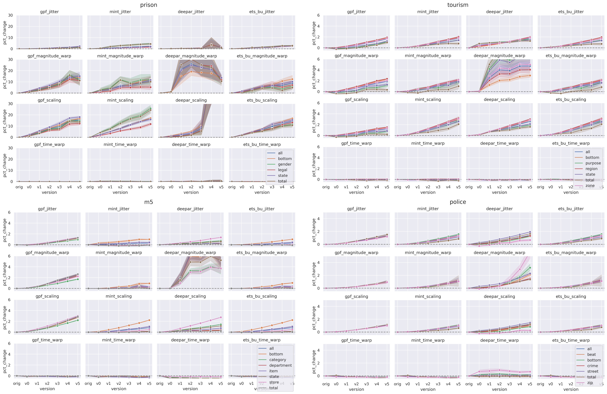

[](https://github.com/luisroque/robustness_hierarchical_time_series_forecasting_algorithms/blob/main/LICENSE)

[](https://pepy.tech/project/tsaugmentation)

# RHiOTS: A Framework for Evaluating Hierarchical Time Series

This repository provides the implementation of RHiOTS, a novel methodology for evaluating the robustness of HTS (hierarchical time series) forecasting algorithms on real-world datasets. It includes a comprehensive framework that extends beyond the traditional evaluation of predictive performance, enabling a more reliable method for selecting the appropriate HTSF algorithm for a given problem than existing benchmark-based approaches. Additionally, the repository provides a set of parameterizable transformations to simulate changes in the data distribution.

You can install tsagumentation as a python package
```python
pip install tsaugmentation
```

## Functionality


The main functionality of this repository includes:

* **RHiOTS Methodology:** The implementation of the RHiOTS methodology for evaluating the robustness of HTS forecasting algorithms on real-world datasets.
* **Comprehensive Framework:** A comprehensive framework that extends beyond the traditional evaluation of predictive performance, including methods for evaluating forecast accuracy, forecast stability, and forecast bias.
* **Algorithm Selection:** A more reliable method for selecting the appropriate HTSF algorithm for a given problem than existing benchmark-based approaches.
* **Parameterizable Transformations:** A set of parameterizable transformations to simulate changes in the data distribution.


## Getting started
The code below creates new versions of the prison dataset by applying time series augmentation transformations.

```python
import tsaugmentation as tsag

# Creates a transformation class
data = tsag.transformations.CreateTransformedVersions(
    dataset_name='prison'
)

# Creates new versions of the prison dataset
data.create_new_version_single_transf()
```

## Experimental Results

We have conducted experiments to evaluate the impact of time series dependency alterations on Hierarchical Time Series forecasting models using the semi-synthetic datasets generated by RHiOTS. You can find an example image below that shows the RMSE percentage differences for each model, transformation, and version across multiple datasets.

The image displays the relationship between model performance and applied transformations. Rows correspond to transformations, while columns represent models. The x-axis shows different transformation parameter versions, and the y-axis presents the RMSE percentage differences compared to the original dataset.

These results highlight the influence of hierarchical structure on forecasting performance. The image visualizes data groups, colors, and confidence intervals, offering a high-level analysis that helps users assess the performance and robustness of various forecasting models when applied to time series data with varying dependency alterations.




### Contributing
We welcome contributions to this repository. If you find a bug, or if you have an idea for a new feature, please open an issue or submit a pull request.

### License
This repository is licensed under the BSD 3-Clause License. See the LICENSE file for more information.